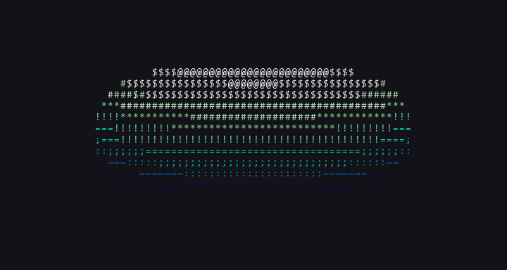

# Spinning Donut in C++

A 3D spinning donut (torus) rendered entirely in the terminal using ASCII characters and ANSI color codes. No graphics libraries, no GPU, no external dependencies. Just raw math, trigonometry, and `stdout`.

This project is heavily inspired by [**Andy Sloane's original `donut.c`**](https://www.a1k0n.net/2011/07/20/donut-math.html) (2006/2011) and the viral "Donut-shaped C code that generates a 3D spinning donut" phenomenon. I first discovered this through the [**Joma Tech video**](https://www.youtube.com/watch?v=sW9npZVpiMI) and thought it was one of the hardest, most mind-bending things I'd ever seen, so I had to try it myself.

This version adds **ANSI 256-color gradients**, **flicker-free single-write rendering**, and **delta-time rotation** on top of the original concept.

---

## Table of Contents

- [Demo](#demo)
- [How It Works - The Math](#how-it-works---the-math)
  - [Prerequisite Concepts](#prerequisite-concepts)
  - [Step 1: The Unit Circle and Trigonometry](#step-1-the-unit-circle-and-trigonometry)
  - [Step 2: Solids of Revolution - Building the Torus](#step-2-solids-of-revolution---building-the-torus)
  - [Step 3: Vectors in 3D Space](#step-3-vectors-in-3d-space)
  - [Step 4: Rotation Matrices - Spinning the Donut](#step-4-rotation-matrices---spinning-the-donut)
  - [Step 5: Multiplying It Out](#step-5-multiplying-it-out)
  - [Step 6: Perspective Projection - 3D to 2D](#step-6-perspective-projection---3d-to-2d)
  - [Step 7: Z-Buffering - Depth Sorting](#step-7-z-buffering---depth-sorting)
  - [Step 8: Surface Normals](#step-8-surface-normals)
  - [Step 9: The Dot Product - Illumination](#step-9-the-dot-product---illumination)
  - [Step 10: ASCII Shading](#step-10-ascii-shading)
  - [Step 11: ANSI Color Gradient](#step-11-ansi-color-gradient)
  - [Step 12: Rendering the Frame](#step-12-rendering-the-frame)
- [Constants & Parameters](#constants--parameters)
- [Build & Run](#build--run)
- [References & Sources](#references--sources)

---

## Demo



<details>
<summary>ASCII text preview (for terminals without color support)</summary>

```
                 .::;;;;;;!!*****!!;;::~
             ,:;=!**##$$@@@@@@@@$$##**!=;:,
          ,-:;=!*#$$@@@@@@@@@@@@@@@@$$#*!=;:-,
        .~:;=!*#$@@@@@@@@@@@@@@@@@@@@@@$#*!=;:~.
      .-:;=!*#$@@@@@@@@@@@@@@@@@@@@@@@@@$#*!=;:-.
     ,~:;=*#$@@@@@@@@@@@@@@@@@@@@@@@@@@@@$#*=;:~,
    ,-:;=!#$@@@@@@@@@@@@@@@@@@@@@@@@@@@@@$#!=;:-,
    ~:;=!*$@@@@@@@@@@@@@@@@@@         @@@@$*!=;:~
   ,:;=!*#@@@@@@@@@@@@@@                @@@#*!=;:,
   ~:;=!*$@@@@@@@@@@@                   @@$*!=;:~
   :;=!*#$@@@@@@@@@@                    @$#*!=;:
   :;=!*#$@@@@@@@@@                     $#*!=;:~
   :;=!*#$@@@@@@@@@                     $#*!=;:
   ~;=!*#$@@@@@@@@@                    @$#*!=;:
   ,:;=!*#@@@@@@@@@@                  @@#*!=;:,
    ~:;=!*$@@@@@@@@@@@@             @@@$*!=;:~
    ,-:;=!#$@@@@@@@@@@@@@@@@@@@@@@@@@@$#!=;:-,
     ,~:;=*#$@@@@@@@@@@@@@@@@@@@@@@@@$#*=;:~,
       -:;=!*#$@@@@@@@@@@@@@@@@@@@@$#*!=;:-
        .~:;=!*#$@@@@@@@@@@@@@@@@$#*!=;:~.
          ,-:;=!*#$$@@@@@@@@@@$$#*!=;:-,
             ,:;=!**##$$$$$$##**!=;:,
                 .::;;;;;;!!;;::~
```

</details>

---

## How It Works - The Math

This is genuinely one of the most mathematically dense small programs you will ever see for its size. There is no 3D model file, no graphics library, no GPU. Every single frame, the program calculates thousands of 3D points from scratch using pure trigonometry, rotates them through 3D space using linear algebra, squashes them onto your flat terminal screen using perspective projection, and then figures out how brightly to shade each one using vector math. All of that happens roughly 60 times per second.

Below is the full derivation, step by step, from the ground up.

### Prerequisite Concepts

Before diving in, here is a quick refresher on the foundational math this program relies on. If you are already comfortable with trig and vectors, feel free to skip ahead to [Step 2](#step-2-solids-of-revolution---building-the-torus).

### Step 1: The Unit Circle and Trigonometry

Everything in this program comes back to the **unit circle**, a circle of radius 1 centered at the origin. For any angle `t` measured from the positive x-axis:

```
x = cos(t)
y = sin(t)
```

This gives you the `(x, y)` coordinates of the point on the circle at that angle. Some key properties:

- `cos(t)` gives the horizontal distance from the origin.
- `sin(t)` gives the vertical distance from the origin.
- As `t` sweeps from `0` to `2pi` (about `6.28`), the point traces out a full circle.
- The Pythagorean identity always holds: `cos²(t) + sin²(t) = 1`.

To make a circle of radius `R` instead of radius 1, you just scale:

```
x = R · cos(t)
y = R · sin(t)
```

This is the building block for everything that follows. The entire donut is constructed by combining two circular sweeps at different radii and orientations.

### Step 2: Solids of Revolution - Building the Torus

A **solid of revolution** is a 3D shape you get by taking a 2D curve and spinning it around an axis. Think of a potter's wheel: a flat profile spins around and traces out a vase, a bowl, or in our case, a donut.

A donut (the mathematical name is a **torus**) is the solid of revolution you get from spinning a circle around an axis that does not pass through the circle itself.

Here is the construction step by step:

**Step 2a: Start with a circle in 2D.**

Take a circle of radius `R1` (the tube's cross-section). Place it on the xz-plane, centered at distance `R2` from the origin along the x-axis. The parametric equations for a point on this circle are:

```
x = R2 + R1 · cos(theta)
y = 0
z = R1 · sin(theta)
```

Where `theta` sweeps from `0` to `2pi`. This traces out a vertical circle sitting `R2` units away from the y-axis.

In the code, `R1 = 1` (tube radius) and `R2 = 2` (distance from the center to the tube), so the donut looks proportionally like a real one.

**Step 2b: Revolve it around the y-axis.**

Now take that circle and sweep it around the y-axis by another angle `phi`, also from `0` to `2pi`. This is the "revolution" part. To rotate a point `(x, 0, z)` around the y-axis by angle `phi`, we apply:

```
x_new = x · cos(phi)
y_new = x · sin(phi)
z_new = z
```

Substituting our circle equations in:

```
x = (R2 + R1 · cos(theta)) · cos(phi)
y = (R2 + R1 · cos(theta)) · sin(phi)
z = R1 · sin(theta)
```

These three equations define every single point on the surface of the torus. By looping `theta` from `0` to `2pi` and `phi` from `0` to `2pi`, we visit every point on the donut's surface.

In the code, this appears as the nested loop structure:

```cpp
for (float theta = 0; theta < 6.28f; theta += THETA_STEP) {
    for (float phi = 0; phi < 6.28f; phi += PHI_STEP) {
        float cx = R2 + R1 * cosT;   // R2 + R1·cos(theta)
        float cy = R1 * sinT;        // R1·sin(theta)
        // cx and cy are then transformed by phi and the rotation angles
    }
}
```

The variable `cx` is `R2 + R1·cos(theta)` and `cy` is `R1·sin(theta)`. These represent the cross-section circle before it gets swept around.

### Step 3: Vectors in 3D Space

A **vector** is a quantity with both magnitude and direction. In this program, we work with 3D vectors represented as `(x, y, z)`.

Key vector concepts used here:

**Magnitude (length):**

```
|v| = sqrt(x² + y² + z²)
```

**Unit vector** (a vector with length 1):

```
v_hat = v / |v|
```

**Dot product** of two vectors `a = (a1, a2, a3)` and `b = (b1, b2, b3)`:

```
a · b = a1·b1 + a2·b2 + a3·b3
```

The dot product has a geometric interpretation:

```
a · b = |a| · |b| · cos(angle between a and b)
```

This means:

- If the vectors point in the same direction, the dot product is positive (and maximum).
- If they are perpendicular, the dot product is zero.
- If they point in opposite directions, the dot product is negative.

This property is exactly what we need for lighting calculations later. If a surface points toward a light source (small angle), the dot product is large and positive, meaning it is brightly lit. If it points away (large angle), the dot product is negative, meaning it is in shadow.

### Step 4: Rotation Matrices - Spinning the Donut

The donut we built in Step 2 is static. To animate it spinning, we need to rotate every point in 3D space. The standard way to do this is with **rotation matrices**.

A rotation matrix is a 3x3 matrix that, when multiplied with a 3D point, rotates that point around a specific axis by a given angle. The three fundamental rotation matrices are:

**Rotation around the X-axis by angle A:**

```
         | 1    0       0    |
Rx(A) =  | 0   cos(A)  -sin(A)|
         | 0   sin(A)   cos(A)|
```

This keeps the x-coordinate fixed and rotates the point in the yz-plane.

**Rotation around the Y-axis by angle B:**

```
         | cos(B)   0   sin(B)|
Ry(B) =  |   0      1     0   |
         |-sin(B)   0   cos(B)|
```

This keeps the y-coordinate fixed and rotates in the xz-plane.

**Rotation around the Z-axis by angle B:**

```
         | cos(B)  -sin(B)   0 |
Rz(B) =  | sin(B)   cos(B)   0 |
         |   0        0      1 |
```

This keeps the z-coordinate fixed and rotates in the xy-plane.

In this program, the donut rotates around the **X-axis** by angle `A` and the **Z-axis** by angle `B`. Each frame, `A` and `B` are incremented slightly, making the donut spin continuously.

To apply both rotations, we multiply the point by both matrices: `Rz(B) * Rx(A) * point`. The order matters because matrix multiplication is not commutative.

### Step 5: Multiplying It Out

Rather than writing a generic matrix multiplication function (which would be slower), the code expands the matrix multiplications algebraically and computes the final `(x, y, z)` directly.

Starting with our torus point before rotation:

```
circleX = R2 + R1 · cos(theta)
circleY = R1 · sin(theta)
```

We first apply the revolution around the y-axis (by `phi`), then the rotation matrices. After churning through all the algebra (multiplying `Rz(B) * Rx(A)` with the revolved point), the final 3D coordinates are:

```
x = circleX · (cosB · cosPhi + sinA · sinB · sinPhi) - circleY · cosA · sinB
y = circleX · (sinB · cosPhi - sinA · cosB · sinPhi) + circleY · cosA · cosB
z = cosA · circleX · sinPhi + circleY · sinA
```

This matches exactly what appears in the code:

```cpp
float x = cx * (cosB * cosP + sinA * sinB * sinP) - cy * cosA * sinB;
float y = cx * (sinB * cosP - sinA * cosB * sinP) + cy * cosA * cosB;
float z = cosA * cx * sinP + cy * sinA;
```

The key optimization here is that `sinA`, `cosA`, `sinB`, `cosB` are computed once per frame (outside the loops), while `sinT`, `cosT` are computed once per theta step, and `sinP`, `cosP` are computed once per phi step. This avoids calling `sin()` and `cos()` redundantly thousands of times.

### Step 6: Perspective Projection - 3D to 2D

Your terminal screen is a flat, 2D grid of characters. To display a 3D object on it, we need **perspective projection**: the technique of making closer things look bigger and farther things look smaller, just like your eyes do in real life.

**The geometry behind it:**

Imagine you are sitting at the origin `(0, 0, 0)`, looking down the positive z-axis. There is a screen (your terminal) at distance `K2` in front of you. Behind the screen, at various depths, are the points of the donut.

For any 3D point `(x, y, z)`, we want to find where it appears on the screen. The viewer, the screen point, and the 3D point form similar right triangles. By the properties of similar triangles:

```
x' / K1  =  x / (z + K2)
y' / K1  =  y / (z + K2)
```

Solving for the screen coordinates:

```
x' = (K1 · x) / (z + K2)
y' = (K1 · y) / (z + K2)
```

Where:

- `K1` is the projection scale factor. It controls how large the donut appears on screen. It is derived from the terminal height so that the donut fills the viewport without getting clipped.
- `K2` is the distance from the viewer to the center of the donut. Set to `5` in this code.

Notice that dividing by `(z + K2)` is what creates the depth effect. Points with large z (far away) get divided by a bigger number, making them appear smaller and closer to the center. Points with small z (close to the viewer) get divided by a smaller number, making them appear bigger.

The code computes `1 / (z + K2)` once and stores it as `invZ`:

```cpp
float invZ = 1.0f / (z + K2);
int px = (int)(WIDTH / 2 + K1 * invZ * x);
int py = (int)(HEIGHT / 2 - K1 * invZ * y * 0.5f);
```

The `WIDTH / 2` and `HEIGHT / 2` offsets center the donut on screen. The `0.5f` on `y` is an aspect ratio correction because terminal characters are roughly twice as tall as they are wide, so vertical distances need to be halved to look proportional.

### Step 7: Z-Buffering - Depth Sorting

When thousands of 3D points are projected onto a 2D screen, many of them will land on the same screen pixel. Some of those points are on the front of the donut (facing the viewer) and some are on the back (hidden behind the front surface). We only want to draw the closest one.

This is solved with a **z-buffer** (also called a depth buffer). It is an array the same size as the screen, initialized to zero. Each entry stores the `invZ` (the reciprocal depth, `1/z`) of whatever has been drawn at that pixel so far.

The algorithm:

1. For each new point, compute its screen position `(px, py)` and its `invZ`.
2. Look up the z-buffer at that position.
3. If `invZ > zbuffer[px, py]`, this new point is closer to the viewer than whatever was drawn there before. So we overwrite both the z-buffer and the output character.
4. If `invZ <= zbuffer[px, py]`, this point is behind something already drawn. Skip it.

Using `invZ` (inverse depth) instead of `z` directly has two advantages:

- `invZ = 0` naturally represents infinite depth, so the buffer can be initialized to 0 (everything starts infinitely far away).
- We already computed `invZ` for the perspective projection, so we can reuse it for free.

```cpp
if (py > 0 && py < HEIGHT && px > 0 && px < WIDTH && invZ > zbuf[idx]) {
    zbuf[idx] = invZ;
    // draw the character
}
```

This is the same fundamental technique that every modern GPU uses to render 3D graphics, just implemented in software with ASCII characters instead of pixels.

### Step 8: Surface Normals

To light the donut realistically, we need to know which direction each point on the surface is facing. This direction is called the **surface normal**: a vector that points straight outward, perpendicular to the surface at that point.

**Deriving the normal for a torus:**

Think about the torus before any rotation is applied. At any point on the cross-section circle (parameterized by theta), the outward direction from the tube is simply the radial direction of that small circle:

```
normal_x = cos(theta)
normal_y = 0
normal_z = sin(theta)
```

This is just the unit circle again. The normal points away from the center of the tube's cross-section.

When we revolve this circle around the y-axis (by phi), the normal rotates the same way:

```
normal_x = cos(theta) · cos(phi)
normal_y = cos(theta) · sin(phi)
normal_z = sin(theta)
```

And when we apply the same rotation matrices (Rx(A) and Rz(B)) that we applied to the surface point, we apply them to the normal too. The result, after the same algebraic expansion as in Step 5, is the rotated normal vector `(Nx, Ny, Nz)`.

The key insight is that the surface normal undergoes the exact same sequence of transformations as the surface point, except we start with the unit-circle point `(cos(theta), sin(theta), 0)` instead of the full torus point.

### Step 9: The Dot Product - Illumination

Now that we have the surface normal at every point, we can compute how much light hits that point.

**The lighting model:**

We choose a fixed light direction vector. In this program, the light comes from behind and above the viewer, represented by the direction `(0, 1, -1)`. Technically this should be normalized (divided by its length, which is sqrt(2)), but we compensate for this later when we scale the luminance.

The brightness of a point is determined by the **dot product** between the surface normal `N` and the light direction `L`:

```
luminance = N · L = Nx·Lx + Ny·Ly + Nz·Lz
```

Since `Lx = 0`, `Ly = 1`, `Lz = -1`, this simplifies to:

```
luminance = Ny - Nz
```

The geometric meaning: the dot product equals `|N| · |L| · cos(angle)`. When the surface directly faces the light (angle = 0), `cos(0) = 1` and luminance is at its maximum. When the surface is perpendicular to the light (angle = 90 degrees), `cos(90) = 0` and luminance is zero. When the surface faces away from the light (angle > 90 degrees), the cosine is negative and luminance is negative.

After substituting the full expressions for `Ny` and `Nz` (the rotated normal components from Step 8), we get the expanded luminance formula that appears in the code:

```cpp
int N = (int)(8.0f * ((cosT * cosP * sinB)
    - cosA * cosT * sinP
    - sinA * sinT
    + cosB * (cosA * sinT - cosT * sinA * sinP)));
```

The factor of `8.0f` scales the raw luminance (which ranges from `-sqrt(2)` to `+sqrt(2)`, roughly `-1.41` to `+1.41`) into the range needed to index into the character set. After scaling, `N` ranges from about `-11.3` to `+11.3`.

If `N < 0`, the surface faces away from the light and is not drawn (it is in shadow or on the back side of the donut).

If `N >= 0`, the value is used as an index into the shading characters.

### Step 10: ASCII Shading

The luminance value `N` is used to select a character from a 12-character brightness ramp:

```
.,-~:;=!*#$@
```

Each character has a different visual "density" of ink on screen:

| Index | Character | Visual density        |
| ----- | --------- | --------------------- |
| 0     | `.`       | Very sparse (dimmest) |
| 1     | `,`       | Sparse                |
| 2     | `-`       | Light                 |
| 3     | `~`       | Light-medium          |
| 4     | `:`       | Medium-light          |
| 5     | `;`       | Medium                |
| 6     | `=`       | Medium-heavy          |
| 7     | `!`       | Heavy                 |
| 8     | `*`       | Very heavy            |
| 9     | `#`       | Dense                 |
| 10    | `$`       | Very dense            |
| 11    | `@`       | Maximum (brightest)   |

The code clamps `N` to the range `[0, 11]` and indexes into this string:

```cpp
int L = N > 0 ? N : 0;
if (L > 11) L = 11;
output[idx] = ".,-~:;=!*#$@"[L];
```

This single string is effectively the entire "shader" of the renderer. By carefully choosing characters with increasing visual weight, you get a surprisingly convincing illusion of smooth 3D lighting using nothing but text.

### Step 11: ANSI Color Gradient

The original `donut.c` was plain white text on a black background. This version adds color on top of the ASCII luminance using **ANSI 256-color escape codes**.

Each of the 12 luminance levels is mapped to a specific terminal color, creating a gradient from dark navy (shadows) through teal and cyan (mid-tones) to pure white (highlights):

| Luminance | Character | Color       | ANSI Code  |
| --------- | --------- | ----------- | ---------- |
| 0         | `.`       | Dark Navy   | `38;5;17`  |
| 1         | `,`       | Navy        | `38;5;18`  |
| 2         | `-`       | Deep Blue   | `38;5;19`  |
| 3         | `~`       | Steel Blue  | `38;5;25`  |
| 4         | `:`       | Blue        | `38;5;31`  |
| 5         | `;`       | Teal        | `38;5;37`  |
| 6         | `=`       | Cyan        | `38;5;43`  |
| 7         | `!`       | Aqua        | `38;5;79`  |
| 8         | `*`       | Light Green | `38;5;115` |
| 9         | `#`       | Pale Mint   | `38;5;151` |
| 10        | `$`       | Near-White  | `38;5;188` |
| 11        | `@`       | Pure White  | `38;5;231` |

The escape code format is `\x1b[38;5;{color_number}m`, where `38;5` selects 256-color foreground mode and the number specifies which of the 256 colors to use. The code `\x1b[0m` resets the color back to the terminal default after each character.

### Step 12: Rendering the Frame

The original `donut.c` used `putchar()` to output each character one at a time. This works, but each `putchar` call is a separate system call, and the terminal may redraw after each one, causing visible flicker as the frame is drawn from top to bottom.

This version builds the entire frame (including all ANSI color codes) into a single `std::string` in memory first, then flushes it to `stdout` in one write:

```cpp
std::string frame;
frame.reserve(SIZE * 16);
frame += "\x1b[H";             // move cursor to top-left

for (int j = 0; j < HEIGHT; j++) {
    for (int i = 0; i < WIDTH; i++) {
        int idx = i + WIDTH * j;
        if (output[idx] != ' ') {
            frame += GRADIENT[lum[idx]];  // color escape code
            frame += output[idx];         // the ASCII character
            frame += RESET;               // reset color
        } else {
            frame += ' ';
        }
    }
    frame += '\n';
}

std::cout << frame << std::flush;
```

The escape code `\x1b[H` moves the cursor to the top-left corner instead of clearing the screen, which prevents the blank-frame flash you would get with a full clear.

The rotation angles `A` and `B` are incremented based on the actual elapsed time (delta time), not per frame. This means the donut spins at a consistent speed regardless of how fast or slow the CPU renders each frame:

```cpp
float dt = std::chrono::duration<float>(now - prev).count();
A += 1.2f * dt;
B += 0.6f * dt;
```

---

## Constants & Parameters

| Constant     | Value                | Purpose                                                                 |
| ------------ | -------------------- | ----------------------------------------------------------------------- |
| `R1`         | `1.0`                | Tube (cross-section) radius                                             |
| `R2`         | `2.0`                | Distance from origin to the center of the tube                          |
| `K2`         | `5.0`                | Distance from the viewer to the donut                                   |
| `K1`         | `(H-4)·K2 / (R1+R2)` | Projection scale, derived from terminal height so the donut always fits |
| `THETA_STEP` | `0.04`               | Angular resolution for the cross-section                                |
| `PHI_STEP`   | `0.02`               | Angular resolution for the sweep around the axis                        |
| `WIDTH`      | `80`                 | Terminal columns                                                        |
| `HEIGHT`     | `24`                 | Terminal rows                                                           |

---

## Build & Run

### Prerequisites

- A C++ compiler with C++11 or later support (e.g., `g++`, `clang++`, `MSVC`)
- A terminal that supports ANSI escape codes (VS Code terminal, Windows Terminal, most Linux/macOS terminals)

### Compile & Run

```bash
g++ -O2 main.cpp -o donut.exe
./donut.exe
```

Press **Ctrl+C** to stop.

> **Note:** The old `cmd.exe` on Windows does not support ANSI escape codes. Use **Windows Terminal** or the **VS Code integrated terminal** instead.

---

## References & Sources

- Sloane, Andy. "Donut Math: How Donut.c Works." _a1k0n.net_, 20 Jul. 2011, [www.a1k0n.net/2011/07/20/donut-math.html](https://www.a1k0n.net/2011/07/20/donut-math.html). The original, comprehensive mathematical breakdown of the `donut.c` program.

- Sloane, Andy. "Obfuscated C Donut." _a1k0n.net_, 15 Sep. 2006, [www.a1k0n.net/2006/09/15/obfuscated-c-donut.html](https://www.a1k0n.net/2006/09/15/obfuscated-c-donut.html). The original obfuscated C source code.

- Sloane, Andy. "Optimizing Donut." _a1k0n.net_, 13 Jan. 2021, [www.a1k0n.net/2021/01/13/optimizing-donut.html](https://www.a1k0n.net/2021/01/13/optimizing-donut.html). Follow-up article with performance optimizations.

- Joma Tech. "The Most Satisfying Video in the World (Coding)." _YouTube_, uploaded by Joma Tech, [www.youtube.com/watch?v=sW9npZVpiMI](https://www.youtube.com/watch?v=sW9npZVpiMI). The video that inspired this project.

- "Torus." _Wikipedia_, Wikimedia Foundation, [en.wikipedia.org/wiki/Torus](https://en.wikipedia.org/wiki/Torus). Mathematical definition and parametric equations for the torus.

- "Rotation Matrix." _Wikipedia_, Wikimedia Foundation, [en.wikipedia.org/wiki/Rotation_matrix](https://en.wikipedia.org/wiki/Rotation_matrix). Standard 3D rotation matrices used for the X-axis and Z-axis rotations.

- "Z-buffering." _Wikipedia_, Wikimedia Foundation, [en.wikipedia.org/wiki/Z-buffering](https://en.wikipedia.org/wiki/Z-buffering). The depth-buffering technique used to handle overlapping surfaces.

- "Dot Product." _Wikipedia_, Wikimedia Foundation, [en.wikipedia.org/wiki/Dot_product](https://en.wikipedia.org/wiki/Dot_product). The vector operation used to compute surface illumination.

- "Surface Normal." _Wikipedia_, Wikimedia Foundation, [en.wikipedia.org/wiki/Normal\_(geometry)](<https://en.wikipedia.org/wiki/Normal_(geometry)>). The perpendicular direction to a surface, used for lighting calculations.

- "Solid of Revolution." _Wikipedia_, Wikimedia Foundation, [en.wikipedia.org/wiki/Solid_of_revolution](https://en.wikipedia.org/wiki/Solid_of_revolution). The technique of generating a 3D shape by rotating a 2D curve around an axis.

- "ANSI Escape Code." _Wikipedia_, Wikimedia Foundation, [en.wikipedia.org/wiki/ANSI_escape_code](https://en.wikipedia.org/wiki/ANSI_escape_code). Reference for the 256-color terminal escape sequences.

- _C++ Reference_. cppreference.com, [en.cppreference.com](https://en.cppreference.com/). Documentation for `<cmath>`, `<chrono>`, `<thread>`, `<cstring>`, and `<iostream>`.
